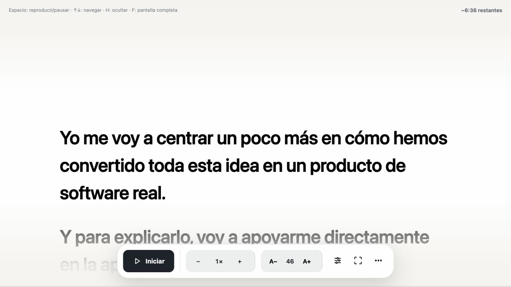

# Teleprompter

**Habla con naturalidad. Tu discurso, siempre a la altura de la mirada.**

Un teleprompter web rápido y sin distracciones. Pega o edita tu guion, adapta la lectura a tu ritmo y entra en pantalla completa. No requiere cuentas, no envía el texto a ningún servidor y recuerda tu discurso en el navegador.

**[Abrir Teleprompter](https://jlfernandezfernandez.github.io/teleprompter/)**



## Funciones

- Texto grande con ancho de lectura cómodo.
- Scroll automático opcional con reproducción y pausa.
- Tiempo restante estimado y progreso de lectura.
- Velocidad y tamaño de letra ajustables.
- Ancho de lectura y espaciado entre líneas ajustables.
- Temas automático, claro y oscuro.
- Edición directa del discurso.
- Controles ocultables y modo de pantalla completa.
- Navegación manual con teclado, ratón o pantalla táctil.
- Texto y preferencias guardados automáticamente mediante `localStorage`, incluso al cerrar el navegador.
- Diseño adaptable para escritorio y móvil.

## Tecnologías

El proyecto usa [Svelte](https://svelte.dev/), [Vite](https://vite.dev/) y TypeScript. Esta combinación mantiene la aplicación pequeña y fácil de mantener sin añadir infraestructura innecesaria.

## Requisitos

- Node.js 22 o posterior.
- pnpm 11.

## Ejecutar en local

```bash
git clone https://github.com/jlfernandezfernandez/teleprompter.git
cd teleprompter
pnpm install
pnpm dev
```

Abre la dirección local que muestra Vite, normalmente `http://localhost:5173`.

## Comprobaciones

```bash
pnpm check
pnpm build
```

## Atajos

| Tecla | Acción |
| --- | --- |
| `Espacio` | Reproducir o pausar |
| `↑` / `↓` | Navegar manualmente |
| `H` | Ocultar o mostrar los controles |
| `F` | Entrar o salir de pantalla completa |
| `Inicio` | Volver al principio del discurso |

## Privacidad

El discurso y las preferencias se guardan únicamente en el almacenamiento local del navegador. Al borrar los datos del sitio se elimina también esa información.

## Contribuir

Las propuestas y correcciones son bienvenidas. Consulta [CONTRIBUTING.md](CONTRIBUTING.md) antes de abrir un pull request.

## Licencia

Distribuido bajo la licencia MIT. Consulta [LICENSE](LICENSE).
